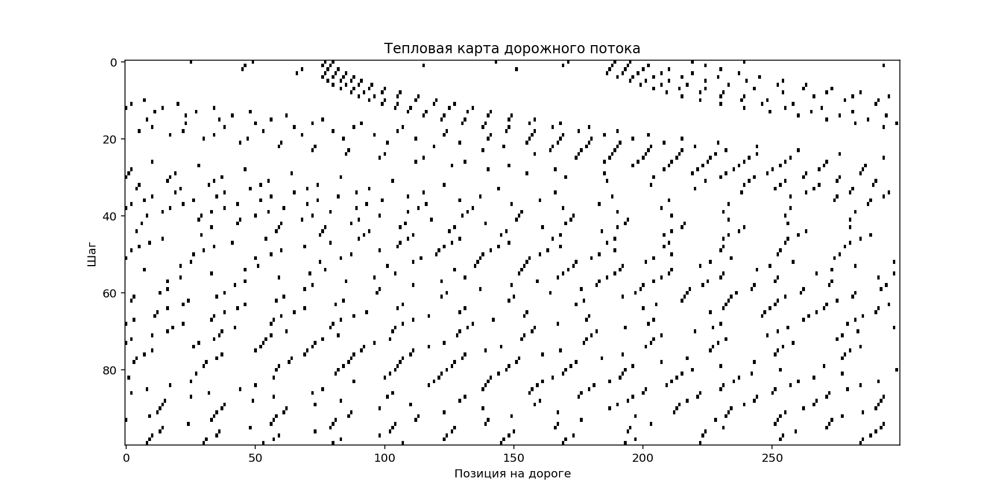
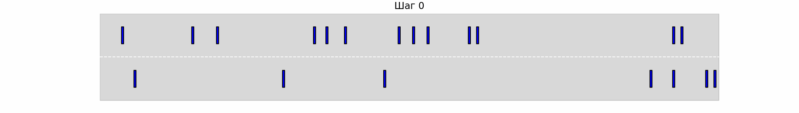
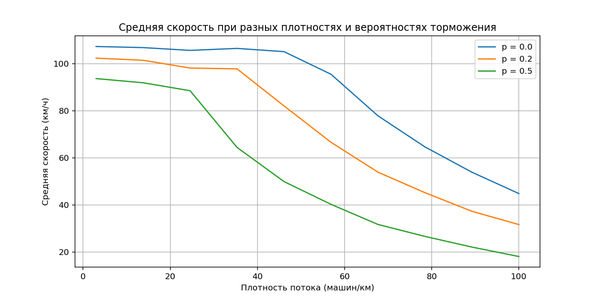

# Моделирование одномерного транспортного потока
Моделирование с помощью клеточных автоматов основывается на дискретизации времени и пространства. В этой работе я рассматриваю одну ихз наиболее известных одномерных моделей микроскопического типа - модель Нагеля-Шрекенберга. В этой модели трасса представляется в виде одномерной решетки, соответствующей однополосной магистрали. Каждая ячейка этой решетки может находиться в двух состояних: быть пустой или содержать только одну частицу (машину). За каждый шаг машина перемещается на целое число ячеек вперед. В случае однополосного движения они не могут обгонять друг друга. Скорость − это количество ячеек, которые автомобиль может преодолеть за один временной шаг. Передвижение машин регулируется правилами обновления состояний ячеек, которые обычно содержат стохастические характеристики. Длина одной ячейки равна длине участка дороги, который занимает одна машина + небольшой зазор. Обычно используется длина ячейки в 7.5 метров.

В этой модели для каждой машины заданы скорость от $0$ до некоторой величины $V_{max}$, $d$ – расстояние между текущей машиной и следующей перед ней, $V_i$ – скорость текущей машины. Правило обновления состоит из следующих подшагов:
1. Ускорение. Если $V_i < V_{max}$, то скорость $i$-го автомобиля увеличивается на единицу, если $V = V_{max}$, то скорость не изменяется;
2. Торможение. Если $d < V_{i−1}$, то скорость $i$-го автомобиля уменьшается до $d−1$;
3. Случайные возмущения. Если $V_i > 0$, то скорость $i$-го автомобиля может быть
уменьшена на единицу с вероятностью $p$; скорость не изменяется, если $V_i = 0$;
4. Движение. Каждый автомобиль продвигается вперед на количество ячеек, соответствующее его новой скорости после выполнения шагов $1-3$.

Модель Нагеля-Шрекенберга является простейшей и воспроизводит только основные особенности реального потока.

# Моделирование двумерного потока транспорта
Для моделирования многополосного движения приведенную выше модель я обобщил на двумерный случай. Трасса в этом случае представляет собой двумерную решетку, где количество ячеек в поперечном направлении соответствует числу полос трассы, а также разрешены перестроения машин из полосы в полосу.

### Также я добавил в модель светофор.

### Применил модель на реальном участке Каширского шоссе

